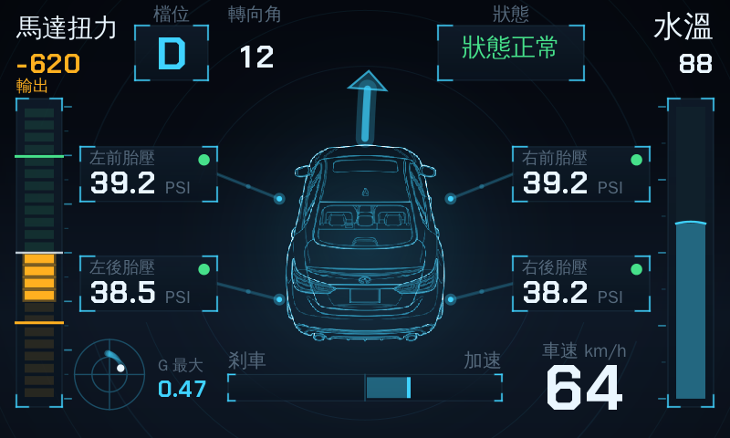

# O.R.I.O.N.


A gauge dashboard for the **Infiniti Q50 3.5 Hybrid (V37)** that runs on the factory InTouch
screen and reads the car's own CAN signals — **no OBD dongle, no Bluetooth, no phone**.

The head unit's Android layer publishes the vehicle bus as ordinary Android `Sensor` objects, so
the whole thing is a normal app reading `SensorManager`. Nothing is written to the bus; nothing in
the factory firmware is modified.



---

## ⚠️ Read this before installing

**This was developed and verified on one car: a Taiwan-market Q50 3.5 Hybrid (VQ35HR + motor),
whose InTouch unit runs a customized Android 2.3.7 (API 10, x86).**

Other years, regions and InTouch generations ship different firmware — different CAN maps,
sometimes a different OS entirely. On those, the app may refuse to load, or it may load and show
numbers that mean something else. **Signal type numbers are not a standard; they are whatever your
unit happens to publish.**

If your car is not that unit, treat everything here as unverified, install only on **a vehicle you
own**, and check every reading against your own gauges before believing it.

The project only ever **reads**. It sends no CAN frames, changes no firmware, and can be removed
from App Garage like any other app.

---

## What the car actually publishes

The single most useful thing in this repository for another owner is probably
**[`docs/sensors-vq35hr.md`](docs/sensors-vq35hr.md)** — the full inventory of all 39 signals this
car exposes, with what each one really means, measured on the road rather than assumed.

Some of it is counter-intuitive, and most of it was learned the hard way:

| Signal | What it turned out to be |
|---|---|
| `VS_ID_EFFECTIVE_TORQUE` (12) | The **electric motor's** torque, **signed**: positive regenerates, negative drives. Not engine torque. |
| `VS_ID_STEERING_ANGLE` (25) | Degrees directly, right positive, ±390 at full lock. Not the 0.1° its `resolution` field implies. |
| `VS_ID_VEHICLE_SPEED` (17) | Plain km/h, despite a `maximumRange` of 655340. |
| `VS_ID_ENGINE_RPM` (13) | **Dead.** Held 0.000 through entire warm drives. |
| `VS_ID_REGENERATION` (26) | **Dead.** Flat zero across a full drive with braking. |
| `VS_ID_ECO_MODE` (28) | **Dead.** Never delivers an event at all. |
| Battery state of charge | **Does not exist on this bus.** Not under any name. |

`maximumRange` is not trustworthy — types 12, 13, 16 and 32 all report the same placeholder — so
every scale in the app was derived from observed values, and anything still uncalibrated is drawn
in amber rather than pretending to be an engineering unit.

## The screen

Motor torque on the left as a bipolar column (regeneration up in green, drive down in amber, with
this trip's peak marked on each side), coolant on the right, gear and steering across the top, the
car in the middle with a tyre-pressure callout at each corner, a status panel that names the worst
active condition, a friction circle for lateral and longitudinal g, and road speed.

A tyre reading zero means its sensor has not been heard from yet, not that the tyre is flat, and
the screen says so.

Long-press anywhere to reach settings (language: 中文 / English).

---

## Building

Needs JDK 17+, the Android SDK (`build-tools;34.0.0`, `platforms;android-34`), and Python 3 with
`cryptography`. On Windows use Git Bash or WSL.

```
export ANDROID_SDK=/path/to/android-sdk
bash build.sh                 # -> build/dash.apk and build/dash.epk
```

`build.sh` stamps the version code with the current unix time, because App Garage hides any
candidate whose version code is not higher than what is already installed.

### Seeing the screen without a car

```
bash tools/preview.sh          # normal running state
bash tools/preview.sh warn     # hot coolant, soft tyre, hard braking
bash tools/preview.sh ev       # engine off, still warming
bash tools/preview.sh lock     # full lock at walking pace
bash tools/preview.sh normal en
```

`tools/Preview.java` is a desktop port of the screen's geometry that renders it to PNG at the real
800×480. It exists because the head unit is the slowest imaginable place to discover that two
labels overlap. It models **layout only** — not Android `Paint` state — which is worth knowing: a
stale paint alpha once drew the entire car at four percent opacity while every preview looked
perfect.

### Replacing the artwork or the font

Drop a drawing at `assets/car.png` and a TrueType file at `assets/dash.ttf`; neither needs a code
change. See [`assets/README.md`](assets/README.md) — including `tools/MakeCarAsset.java`, which
converts an ordinary light-on-black drawing into the keyed, tinted PNG the screen wants.

### Installing

1. Format a USB stick as **FAT32** and put `dash.epk` in its **root**.
2. Insert it, wait for "Loading all apps" to finish (up to a minute from cold).
3. From the home screen press **right** once to reach **App Garage**.
4. **Install Apps via USB** → **O.R.I.O.N.** → confirm. Do not pull the stick until it completes.

Self-built and released `.epk` files are signed differently and cannot replace each other — pick
one and stay with it, or uninstall first. `keystore.ks` is generated on first build and is
deliberately not committed, so keep yours if you want your own rebuilds to install over each other.

---

## Credits and sources

- **AppGarage Dash** — the project this began as, MIT licensed. The `.epk` container format, the
  `com.ygomi.permission.IVI_CAN_READ` permission, the `ivi.*` manifest metadata and the App Garage
  loading route all come from there.
- **[@tdpequinox](https://github.com/tdpequinox)** — shared the Q50/Q60 InTouch system images that
  the original reverse engineering was done against. None of this exists without that.
- The signal reference the original carried was calibrated on a **2018 Q60 Red Sport 400
  (VR30DDTT)**. The type numbers carry over to the VQ35HR hybrid; the meanings and scalings
  frequently do not, which is what `docs/sensors-vq35hr.md` records.
- **[Chakra Petch](https://fonts.google.com/specimen/Chakra+Petch)** by Cadson Demak — the display
  face, SIL Open Font License 1.1, full text at
  [`assets/dash.ttf.LICENSE.txt`](assets/dash.ttf.LICENSE.txt).
- `keys/obu_cert.pem` is the **public half** of a fleet certificate that ships inside InTouch
  firmware. No private key, no firmware and no password is distributed — see
  [`keys/README.md`](keys/README.md).
- `assets/car.png` was supplied by this repository's owner. **If you fork or redistribute this,
  check that you have the right to the artwork** — replace it with your own drawing if in doubt.
  Everything else here is either original or credited above.

Not affiliated with Infiniti, Nissan, Ygomi or Airbiquity. "O.R.I.O.N." is just a name. Code is
MIT licensed (see [`LICENSE`](LICENSE)); the bundled font and artwork carry their own terms as
noted above.
